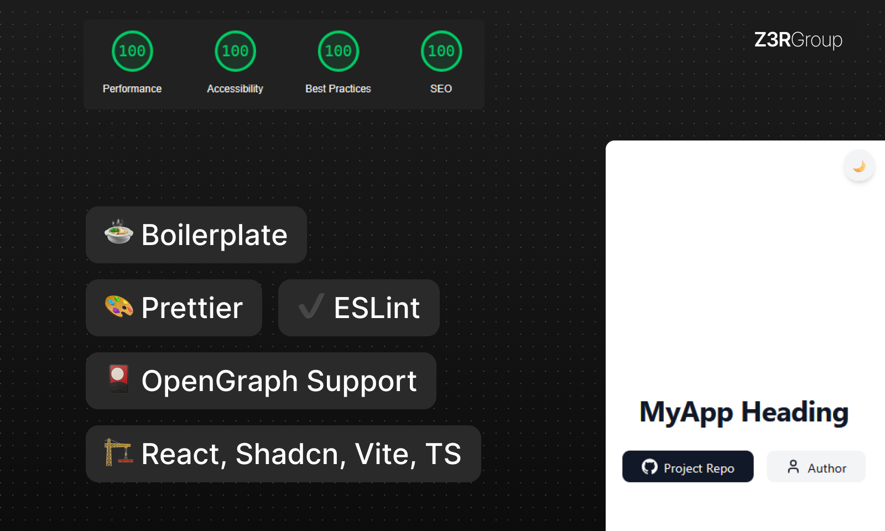

# Shadcn Vite Boilerplate

A simple **React** boilerplate with **TailwindCSS**, **ShadCN UI**, powered by **Vite** with a fully configured **TypeScript** environment, pre-configured tools such as **ESLint** and **Prettier** and **OpenGraph** support.

[](https://vercel.com/import/project?template=https://github.com/mxpanf/shadcn-vite-starter) [](https://app.netlify.com/start/deploy?repository=https://github.com/mxpanf/shadcn-vite-starter)



## 🚀 Features

- **TailwindCSS & ShadCN UI** - Easily customize and use components from ShadCN UI.
- **TypeScript Support** - Fully configured TypeScript project.
- **Pre-configured ESLint & Prettier** - Code quality and formatting tools out of the box.
- **Vite-Powered** - Lightning-fast build tool for React projects.
- **ShadCN UI Components** - Rich UI components such as Avatar, Dialog, Slider, Tabs, etc.
- **Optimized for Development** - Ready to go with fast hot-reload and dev server.

## 📂 Project Structure

```
.
├── LICENSE
├── NOTICE
├── README.md
├── components.json
├── eslint.config.js
├── index.html
├── package.json
├── public
│   ├── index.html
│   └── og-image.jpg
├── src
│   ├── App.tsx
│   ├── components
│   │   ├── Button.tsx
│   │   ├── Heading.tsx
│   │   ├── MetaTags.tsx
│   │   └── ThemeToggle.tsx
│   ├── lib
│   │   └── utils.ts
│   ├── main.tsx
│   ├── styles
│   │   └── global.css
│   └── vite-env.d.ts
├── tailwind.config.ts
├── tsconfig.app.json
├── tsconfig.json
├── tsconfig.node.json
├── vite.config.ts
└── yarn.lock
```

## 🛠️ Installation & Setup

### 1. Clone the repository

```sh
git clone https://github.com/aver005/shadcn-vite-template.git
cd shadcn-vite-starter
```

### 2. Install dependencies

```sh
yarn install
```

### 3. Run the development server

```sh
yarn dev
```

### 4. Open the project

Open your browser and navigate to `http://localhost:3000`.

## 🎨 Customization

### Update Meta Tags

For better SEO and social media previews, make sure to update the `<MetaTags />` component in `src/components/MetaTags.tsx`:

```tsx
<MetaTags
  title="Your App Title"
  description="A brief description of your project"
  image="public/og-image.jpg"
/>
```

> Open Graph Сompatible

> [!WARNING]  
> Changes in this section are required for full - fledged integration into final application. Check the markup before publishing, some SEO & OG functions may not work.

### Add New Components

Add new UI components to the `src/components` folder and reference them in `App.tsx`.

## 🔧 Configuration

### TailwindCSS

Tailwind is pre-configured with Vite. You can customize your Tailwind setup by modifying the `tailwind.config.ts` file.

### ESLint & Prettier

This project comes pre-configured with ESLint and Prettier for code quality and consistency. To run ESLint and Prettier:

```sh
yarn lint     # Run ESLint
yarn format   # Format code with Prettier
```

You can also automatically fix linting issues:

```sh
yarn lint:fix
```

## 📜 License

This project is licensed under the **MIT License**. You are free to use, modify, and distribute this code with proper attribution.

## 🤝 Contributing

Contributions are welcome! Feel free to submit a pull request or open an issue.

## 💡 Acknowledgments

Built with ❤️ using **React**, **TailwindCSS**, **ShadCN UI**, and **Vite**.
